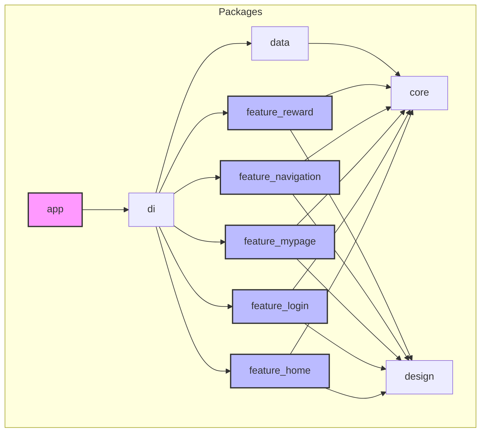

## 🏗️ 패키지 구조 (Package Structure)

이 프로젝트는 기능과 역할을 기준으로 여러 개의 패키지로 분리된 모노레포 구조를 따릅니다. 각 패키지 간의 의존성은 아래 다이어그램과 같습니다.

- **`app`**: 최종 애플리케이션을 구성하고 실행하는 메인 패키지입니다. 모든 `feature`와 공통 모듈을 통합합니다.
- **`feature/*`**: 각 기능 단위로 분리된 패키지입니다. 각 피처는 독립적으로 개발될 수 있습니다.
- **`core`**: 도메인 모델, 공통 유틸리티 등 프로젝트 전반에서 사용되는 핵심 로직을 포함합니다.
- **`data`**: 데이터 소스(API, 로컬 DB)와의 통신, Repository 구현 등 데이터 관련 로직을 담당합니다.
- **`design`**: UI 컴포넌트, 테마, 아이콘, 폰트 등 앱의 디자인 시스템을 관리하는 패키지입니다.
- **`di`**: 의존성 주입(Dependency Injection) 설정을 담당하는 패키지입니다. `get_it`과 `injectable`을 사용하여 각 계층의 의존성을 연결합니다.

## 📚 주요 라이브러리

| 카테고리          | 라이브러리                                 | 설명                                                        |
| ----------------- | ------------------------------------------ | ----------------------------------------------------------- |
| **모노레포 관리** | `melos`                                    | Dart/Flutter 프로젝트를 위한 모노레포 관리 도구             |
| **라우팅**        | `go_router`                                | 선언형 라우팅을 제공하여 복잡한 네비게이션 로직을 쉽게 관리 |
| **의존성 주입**   | `get_it`, `injectable`                     | 서비스 로케이터 및 컴파일 타임 의존성 주입을 구현           |
| **네트워킹**      | `dio`, `retrofit`                          | HTTP 통신 및 Type-safe한 REST API 클라이언트 구현           |
| **데이터 모델**   | `freezed`, `json_serializable`             | 불변 클래스 및 데이터 직렬화/역직렬화 코드 자동 생성        |
| **소셜 로그인**   | `kakao_flutter_sdk_user`, `google_sign_in` | 카카오 및 구글 소셜 로그인을 구현                           |
| **로컬 저장소**   | `shared_preferences`                       | 간단한 Key-Value 데이터를 디바이스에 저장                   |
| **UI/그래픽**     | `flutter_svg`                              | SVG 파일을 Flutter 위젯으로 렌더링                          |
| **기타 유틸리티** | `logger`, `flutter_dotenv`                 | 로깅 및 `.env` 파일을 통한 환경 변수 관리                   |
